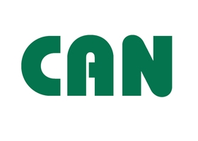
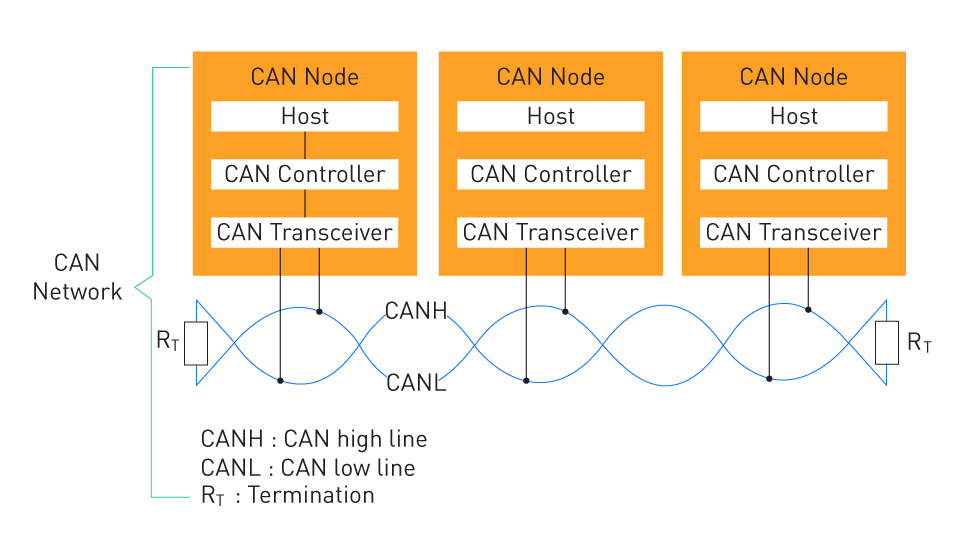
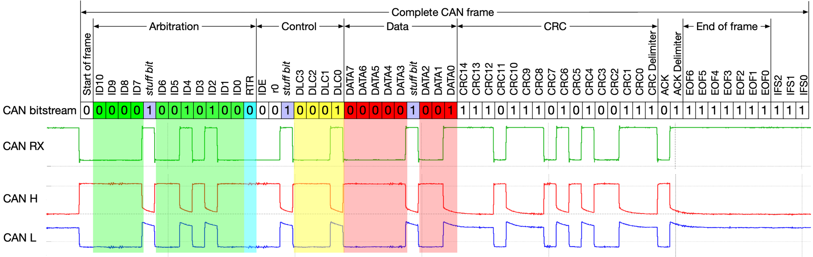
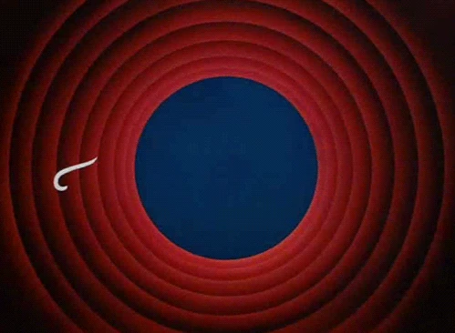

<!--
author:   David Croft
email:    david.croft@warwick.ac.uk
version:  0.2.0
language: en
narrator: UK English Female

classroom: enable
mode: Presentation
icon: https://dscroft.github.io/liascript_materials/assets/logo.svg

import: macros_interface.md
import: macros_dashboard.md

@style
.lia-effect__circle {
    display: none;
}

.flex-container {
    display: flex;
    flex-wrap: wrap; /* Allows the items to wrap as needed */
    align-items: stretch;
    gap: 20px; /* Adds both horizontal and vertical spacing between items */
}

.flex-child { 
    flex: 1;
    margin-right: 20px; /* Adds space between the columns */
}

@media (max-width: 600px) {
    .flex-child {
        flex: 100%; /* Makes the child divs take up the full width on slim devices */
        margin-right: 0; /* Removes the right margin */
    }
}
@end

@onload
// frame receiver
LIA.classroom.subscribe("can-frame", (message) => {
    window.can_message_handler(message["id"], message["data"]);
})

// frame sender
window.send_can_frame = function(frameid, data) {
    LIA.classroom.publish("can-frame", {
        id: frameid,
        data: data
    });
}
@end


@Classroom.defaultManager
------------------------

**CAN bus status: ** 
<script>
    function status()
    {
        if (LIA.classroom.connected) {
            send.lia("LIASCRIPT: **Emulated**<!-- style='color: green;' -->");
        } else {
            send.lia("LIASCRIPT: **Disconnected**<!-- style='color: red;' -->");
        }
    }

    setInterval(() => status, 1000);
    status();
</script> 

------------------------

@end
-->

# Introduction

<section class="flex-container">

<div class="flex-child" style="min-width: 400px;">
This activity is designed to demonstrate how a malicious attacker can intercept and retransmit CAN frames on the CAN network of an intra-vehicle network.

This sort of attack would work on any vehicle with a CAN network but no protection mechanism in place. 

------------------------------

This activity is best done in pairs, with each participant ideally having access to their own computer.

If there aren't enough participants or devices, participants can complete the activity alone by opening two separate browser windows.
</div>

<!-- class="flex-child" style="min-width: 200px;" -->


</section>

------------------------------

You can navigate through the activity using:

- The arrow buttons at the bottom of the page.
- The arrow keys on your keyboard.
- The navigation bar on the left.

You can adjust size and presentation of the page using the presentation mode <i class="icon icon-book lia-btn__icon"></i> and settings <i class="icon icon-settings lia-btn__icon"></i> icons in the top right corner of the page.

You can also adjust language options but this activity has only been tested in English.

-----------------------------

<!--
style="background-color: firebrick; color: white"
-->
>⚠️**Warning**
>
> For the practical part of the activity you will need to be using a reasonably up to date browser version.
>
> - It is not recommanded to use smartphone browsers due to their screen size.


# CAN bus

<section class="flex-container">

<!-- class="flex-child" style="min-width: 100px;" -->


<div class="flex-child" style="min-width: 400px;">
The Controller Area Network (CAN) bus is a vehicle bus standard designed to facilitate communication among various electronic components in a vehicle.

- It was originally developed by Bosch in the 1980s for automotive applications.
  
  - It is now widely used in various industries, including industrial automation, and medical devices.
- Robust communications standard for automotive applications.
  - Only 2 wires so minimal wiring.
  - Interference resistant.
  - CAN 2.0 can go up to 1Mbps (Mega bit per second) but it is resilient.
- New versions of CAN exist to support applications requiring improved data rate
  - CAN FD goes up to 8Mbps
  - The newest currently standardised version of CAN, CAN XL, goes up to 20Mbps.
</div>
</section>

Interference
============

<section class="flex-container">
<div class="flex-child" style="min-width: 400px;">
Uses twisted pair of wires to reduce interference.

- CAN works on voltage difference between CANH and CANL.

  - Not absolute voltage.

- Differential signals (CANL/CANH) helps eliminate interference voltages induced by:

  - Motors.
  - Ignition systems.
  - Switch contacts.

- Since the wires are a twisted pair, any interference will be (approximately) the same on both wires.

  - So the voltage differential remains the same regardless of interference.
</div>

<!-- class="flex-child" style="min-width: 200px;" -->


</section>

CAN frames
==========

Communication on a CAN bus takes place using data frames, each representing a single message transmitted across the network.

- Each frame has a unique identifier (ID), which also determines its priority on the bus:

  - Lower ID = higher priority (i.e., messages with lower IDs are transmitted first).

- The frame carries the actual data, which can be:

  - Up to 8 bytes in Classic CAN.
  - Larger (up to 64 bytes or more) in newer standards like CAN FD and CAN XL.
  - The data typically encodes binary values such as sensor outputs or control signals.

- Control information is also included, such as:

  - The data length code (DLC), specifying the number of data bytes.
  - A checksum (CRC) for error detection and integrity.
  - These aspects are generally handled automatically by the CAN controller hardware.

Communication principle
=====================

<section class="flex-container">

<div class="flex-child" style="min-width: 400px;">
The CAN bus uses a multi-master, broadcast architecture, meaning that:

- Any node can transmit at any time, without needing permission.
- Bus access is determined by message priority:

  - The lower the CAN ID, the higher the priority.
  - In the case of simultaneous transmissions, the message with the lowest ID wins arbitration and continues transmission without collision.

All nodes receive all messages on the bus — this is a fundamental part of the broadcast nature of CAN.

- CAN does not identify the sender of a message.
- There is no built-in source address or authentication. This creates a security vulnerability:

  - Any device that can transmit on the bus can send messages indistinguishable from legitimate nodes.
  - Receiving nodes have no way of verifying who sent the message.
</div>

<!-- class="flex-child" style="min-width: 100px;" -->


</section>

# CAN data format

Over the next couple of pages we will be looking at the format of CAN data and how it can be represented in a more human readable format.





## DBC Format

There are various ways to document the structure of a CAN frame, we are going to use DBC (Database CAN). DBC is a standard file format used to describe the structure of CAN messages.

It tells you:

 - Which CAN IDs are used
 - What each signal in the message represents
 - How to decode and scale the data

For example: the accelerator pedal position information for a 2010 Toyota Prius could be recorded as shown below.

```ascii
Frame ID     Frame Name
     \         /       .------ Frame Length (in bytes)
      \       /       /                    .-- Max value
       v     v       V                    /
   BO_ 81 GAS_PEDAL: 8 XXX               V
    SG_ GAS_PEDAL : 23|8@0+ (0.005,0) [0|1] '' XXX
           ^        ^ ^  ^ ^    ^   ^   ^ 
          /        / /   |  \    \   \   \
Signal name       / /    |   \    \   \   Min value
      Starting bit /     |    \    \  Offset
        Length (in bits) |     \  Scaling factor
                         |  Signed/Unsigned
                Motorola/Intel Format 
```                        

What this specifies is that accelerator pedal position will be transmitted as a value between 0 and 200, stored in bits 23 to 16 for the data payload and that pedal position can be sent in 0.5% increments.

<details>
<summary>**Umm, actually...**</summary>

> In reality the CAN frame ID is 581 on the Prius but for the sake of simplicity for this task we are using classic CAN not CAN-FD and so have to keep our frame IDs <256
</details>

## Encoding information

An accelerator pedal pressed three quarters down would have a value of 0.75.

Below is our 8 byte CAN frame, for the pedal position we set bits 23-16.

<!--
style="
  max-width: 600px;" -->
```ascii
         +----+----+----+----+----+----+----+----+
       0 |  7 |  6 |  5 |  4 |  3 |  2 |  1 |  0 |
         +----+----+----+----+----+----+----+----+
       1 | 15 | 14 | 13 | 12 | 11 | 10 |  9 |  8 |
         ╔════╦════╦════╦════╦════╦════╦════╦════╗
       2 ║ 23 ║ 22 ║ 21 ║ 20 ║ 19 ║ 18 ║ 17 ║ 16 ║
         ╚════╩════╩════╩════╩════╩════╩════╩════╝
Bytes  3 | 31 | 30 | 29 | 28 | 27 | 26 | 25 | 24 |
         +----+----+----+----+----+----+----+----+
       4 | 39 | 38 | 37 | 36 | 35 | 34 | 33 | 32 |
         +----+----+----+----+----+----+----+----+
       5 | 47 | 46 | 45 | 44 | 43 | 42 | 41 | 40 |
         +----+----+----+----+----+----+----+----+
       6 | 55 | 54 | 53 | 52 | 51 | 50 | 49 | 48 |
         +----+----+----+----+----+----+----+----+
       7 | 63 | 62 | 61 | 60 | 59 | 58 | 57 | 56 |
         +----+----+----+----+----+----+----+----+
```

Apply the scaling factor 0.75 / 0.005 = 150, that's 0x96 in hexadecimal or 10010110 in binary.

Which appears as shown below:

<!--
style="
  max-width: 600px;" -->
```ascii
         +----+----+----+----+----+----+----+----+
       0 |    |    |    |    |    |    |    |    |
         +----+----+----+----+----+----+----+----+
       1 |    |    |    |    |    |    |    |    |
         ╔════╦════╦════╦════╦════╦════╦════╦════╗
       2 ║  1 ║  0 ║  0 ║  1 ║  0 ║  1 ║  1 ║  0 ║
         ╚════╩════╩════╩════╩════╩════╩════╩════╝
Bytes  3 |    |    |    |    |    |    |    |    |
         +----+----+----+----+----+----+----+----+
       4 |    |    |    |    |    |    |    |    |
         +----+----+----+----+----+----+----+----+
       5 |    |    |    |    |    |    |    |    |
         +----+----+----+----+----+----+----+----+
       6 |    |    |    |    |    |    |    |    |
         +----+----+----+----+----+----+----+----+
       7 |    |    |    |    |    |    |    |    |
         +----+----+----+----+----+----+----+----+
```

Assuming that there was no other information being sent in this frame, the complete message could look something like:

0000000000000000100101100000000000000000000000000000000000000000

But as that's quite impractical to work in binary, we usually represent the information in hexademical (base 16) format using this conversation table:

<!-- data-type='none' data-title='Binary/hexadecimal/denary conversion' -->
| Binary | Hex | Base 10 |
|--------|-----|---------|
| 0000   | 0   | 0   |
| 0001   | 1   | 1   |
| 0010   | 2   | 2   |
| 0011   | 3   | 3   |
| 0100   | 4   | 4   |
| 0101   | 5   | 5   |
| 0110   | 6   | 6   |
| 0111   | 7   | 7   |
| 1000   | 8   | 8   |
| 1001   | 9   | 9   |
| 1010   | A   | 10   |
| 1011   | B   | 11   |
| 1100   | C   | 12   |
| 1101   | D   | 13   |
| 1110   | E   | 14   |
| 1111   | F   | 15   |

In which case it appears as 0x0000960000000000 where 0x is there to indicate that the data is represented in hexadecimal.


# Activity: 🧑‍🤝‍🧑 Roles and Scenario


These instructions assume you are working in **a two-person group**, with each person taking on a specific role. For clarity, we will refer to these roles as **Alice** and **Charlie**:

---

👩 Alice - The Driver
====

Alice is acting as the **driver** of the vehicle.

- This is a **drive-by-wire** system — there are **no mechanical connections** between the accelerator pedal and the engine.
- When Alice presses the accelerator, a **digital signal is sent over the CAN bus** to the **Engine Control Unit (ECU)**, which then controls the engine response.

---

😈 Charlie - The Attacker
====

Charlie plays the role of a **malicious attacker**.

- Charlie has **unauthorised access to the CAN bus**.
- They can **send and receive CAN messages**, potentially interfering with normal vehicle behaviour.

---

Together, you will simulate a real-world scenario involving both **legitimate control** and a **cybersecurity threat** on a CAN network.


```ascii

       👩     😈     🚗
        |      |      | 
CAN bus *------*------*
```

--------------------------------

CAN bus attacks like this have been demonstrated repeatedly on the production vehicles.

- In 2015 a group of researchers were able to take control of a Jeep Cherokee by sending CAN frames over the vehicle's entertainment system.

  - [Wired.com story.](https://www.wired.com/2015/07/hackers-remotely-kill-jeep-highway/)

- In 2016 a group of researchers were able to take control of a Tesla Model S by sending CAN frames over the vehicle's entertainment system.

  - [Black Hat Europe paper.](https://www.blackhat.com/docs/us-17/thursday/us-17-Nie-Free-Fall-Hacking-Tesla-From-Wireless-To-CAN-Bus-wp.pdf)


!?[Wired.com report on the 2015 Jeep hack](https://www.youtube.com/watch?v=MK0SrxBC1xs "Wired.com report on the 2015 Jeep hack")

{{1}}
> ~~Step 1:~~
>
> **Decide in your groups who will be Alice 👩 and Charlie 😈.**


<!--
style="background-color: firebrick; color: white"
-->
>⚠️**Warning**
>
> Make sure to pay attention to the step numbers as some tasks will require you to you to do things at the same time as other group members.


## Hardware setup

@Classroom.defaultManager

This is the setup we are emulating. 

<section class="flex-container">

<!-- class="flex-child" style="min-width: 500px;" -->
```ascii
             .-------------------. .-------------------.
+--------+   |      +--------+   | |      +--------+   |
|        |   +-.    |        |   | |      |        |   +-.  
|   CANL o <-+ |    |   CANL o <-.-.      |   CANL o <-+ |
|        |     #    |        |            |        |     #
|        |     #    |        |            |        |     # Resistor
|        |     #    |        |            |        |     #
|   CANH * <-+ |    |   CANH * <-.-.      |   CANH * <-+ |
|USB     |   +-.    |USB     |   | |      |USB     |   +-.
+-#------+   |      +-#------+   | |      +-#------+   |
  |          |        |          | |        |          |
  👩         |        😈         | |       🚗          |
             .-------------------. .-------------------.
```

<!-- class="flex-child" style="min-width: 200px;" -->


</section>

When we conduct this activity in the lab we setup an actual CAN bus using Arduino boards and send real CAN frames between them.

- Each group member connected via USB to one of the Arduino circuit boards.
- The Arduino board connected via CAN into a simple CAN bus.
- The CAN bus terminated by appropriate resistors at each end.

Because you are running this practical activity remotely we are using an emulated CAN bus instead, but
the data we are sending is the same as it would be in a real CAN frame.

{{0-1}}
> ~~Step 2:~~
>
> **Make sure you are connected to the emulated CAN bus.**
>
> - The CAN bus status is shown at the top of the page. Please, scroll up and check that this is the case.
>
>   - It it says **Emulated**<!-- style="color: green;" --> then move on to the next step.
> - If it says **Disconnected**<!-- style="color: red;" --> then you need to connect to the classroom.
>
>   1. Click on the share <i class="icon icon-social lia-btn__icon"></i> icon in the top right corner of the page.
>   2. Click on the "Classroom" button.
>   3. Use the provided settings.
>
>     - via Backend: <i class="icon icon-gundb icon-xs"></i> GUN 
>     - room: *Use the provided room name*
>     - maybe password: *Leave blank*
>     - relay server: https://peer.wallie.io/gun
>     - persistent storage: *Leave blank*
>     - Allow scripts to be executed in the chat: *Leave blank*
>   4. Click on the "connect" button.
>


{{1-2}}
> ~~Step 3:~~
>
> **Go to the page that corresponds to your role.**
>
> - Alice 👩 or Charlie 😈.
> 
>   - You can use the navigation bar on the left or the arrow buttons below.


## 👩 Alice 

@Classroom.defaultManager

{{0-1}}
> ~~Step 4:~~
>
> **Use the controls at he bottom of the page to simulate driving the vehicle.**
>
> - When you interact with the controls, the corresponding CAN frames will be sent to the CAN bus.
>
>   - These frames will be picked up by the other devices on the bus e.g. Bob.
>   - These CAN frames are based on *real* frames. E.g. the accelerator pedal frame was taken from a 2010 Toyota Prius.
>
> <script input="submit" default="Press for hint">
"Try using the headlights."
</script>

{{1-2}}
> ~~Step 5~~ 
>
> **Work with Charlie to identify the CAN frames that correspond to the indicators.**
>
> - Press various combinations of the indicator buttons.
>
>   - You may want to make notes.
>
> <script input="submit" default="Press for hint">
"Every time the indicators are used, a frame with ID 203 should be intercepted."
</script>

{{2-3}}
> ~~Step 6~~ 
>
> **Work with Charlie to identify the CAN frames that correspond to the accelerator pedal.**
>
> - Move the accelerator slider to various positions.
>
> <script input="submit" default="Press for hint">
"Every time the accelerator is pressed, a frame with ID 81 should be intercepted."
</script>


{{3-4}}
> ~~Step 7:~~
>
> **Wait while Charlie 😈 injects frames onto the CAN bus.**
>
> - Confirm that the indicator icons on the dashboard are responding to Charlie's 😈 CAN frames.

{{4-5}}
> ~~Step 8:~~
>
> **Wait while Charlie 😈 injects frames onto the CAN bus.**
>
> - Confirm that you do, or do not, have control of the vehicle when Charlie 😈 sends a single accelerator frame.

{{5-6}}
> ~~Step 9:~~
>
> **Wait while Charlie 😈 floods the bus with frames.**
> 
> - Confirm that you do, or do not, have control of the vehicle when Charlie 😈 floods the bus with accelerator CAN frames.

{{6-7}}
> ~~Step 10:~~
>
> **Discuss with Charlie 😈 what is happening.**
>
> - What was the effect of the frames that Charlie 😈 sent?
> - What could a hostile attacker do with this kind of ability?

<section class="flex-container">
<div class="flex-child" style="min-width: 200px; max-width: 50%;">
@can.alice
</div>
<div class="flex-child" style="min-width: 560px;">
@Dashboard.display
</div>
</section>


## 😈 Charlie 

Charlie's role has two parts:

1. Interception.

    - Where we identify the CAN frames that correspond to specific actions.
2. Retransmission.

    - Where we resend CAN frames we have intercepted previously to take control of the vehicle.

### Interception

@Classroom.defaultManager

The Intercept table will show the CAN frames that are being sent and received on the CAN bus.

In this case the information that is being sent between the various micro-controllers in the car.
This is the first step in a man-in-the-middle attack.

For a CAN bus this is passive action and does not need to be literally in the middle.
As long as Charlie 😈 is on the same CAN bus, they can see all the messages being sent.

{{0-1}}
> ~~Step 4~~ 
>
> **Confirm that you are able to intercept CAN frames as Alice 👩 drives the vehicle.**
>
> - You should be able to see the timestamp, frame ID and data as each frame is intercepted.


{{1-2}}
> ~~Step 5~~ 
>
> **Try and identify the CAN frames that correspond to the indicators.**
>
> - Importantly, we don't need to decode or understand the CAN data, just identify which frames correspond to which actions.
>
>   - You may want to make notes.
>
> <script input="submit" default="Press for hint">
"Every time the indicators are used, a frame with ID 203 is intercepted."
</script>

{{2-3}}
> ~~Step 6~~ 
>
> **Try and identify the CAN frames that correspond to the accelerator pedal.**
>
> - What frame ID is sent when the accelerator pedal is pressed?
> - How does the data change when different pedal position are sent?
>
> <script input="submit" default="Press for hint">
"Every time the accelerator is pressed, a frame with ID 81 is intercepted."
</script>

{{3-4}}
> Move on to the retransmission section when you are ready.

<script run-once="true" style="display: block" modify="false">
    console.log("Intercept module loaded");

    if (typeof window.buffer === 'undefined') {
        window.buffer = [];
    }
    
    let bufferMaxSize = 10;
    let counter = 0;

    function addToBuffer(line) 
    {
        buffer.push([counter, Date.now(), ...line]);
        counter += 1;
        if (buffer.length > bufferMaxSize) 
            buffer.shift();
    }

    function displayBuffer()
    {
        let liatable =  "<!-- data-type='none' \n" +
                        "     data-title='Received CAN frames' \n" + 
                        "     data-sortable='false' -"+"->\n" + // bodge for macro parser
                        "| Frame Counter | Timestamp | CAN Frame ID | Data |\n" +
                        "|-|-|-|------|\n"

        for (let i = 0; i < buffer.length; ++i) {  
            let hex = buffer[i][3].map(byte => byte.toString(16).padStart(2, '0').toUpperCase()).join('');
            liatable += `| ${buffer[i][0]} | ${buffer[i][1]} | ${buffer[i][2]} | 0x${hex} |\n`;
        }

        send.lia( "LIASCRIPT: "+liatable );
    }

    LIA.classroom.subscribe("can-frame", (message) => {
        addToBuffer([message["id"], message["data"]]);
        displayBuffer();
    });

    displayBuffer();

    "LIA: wait"
</script>


### Retransmission

@Classroom.defaultManager

Using the controls below, you can inject arbitrary CAN frames into the CAN bus.

{{0-1}}
> ~~Step 7:~~
>
> **Send a CAN frame**
>
> - Use the information from one of the frames that you intercepted previously to turn the indicators on.
> - Confirm with Alice 👩 that the indicators are responding to your CAN frames.
>
> <script input="submit" default="Press for hint">
document.getElementById("can_frame_id").value = 203;
document.getElementById("can_frame_data").value = "0x2000000000000000";
document.getElementById("can_frame_duration").value = 1;
document.getElementById("can_frame_hz").value = 1;
document.getElementById("can_frame_duration").dispatchEvent(new Event('input'));
document.getElementById("can_frame_hz").dispatchEvent(new Event('input'));

"Send a frame to turn both indicators on."
</script>

{{1-2}}
> ~~Step 8:~~
>
> **Send an accelerator frame**
>
> - Single accelerator frame.
> - Confirm with Alice 👩 what happens to the vehicle and if they still have control.
>
> <script input="submit" default="Press for hint">
document.getElementById("can_frame_id").value = 81;
document.getElementById("can_frame_data").value = "0x0000C80000000000";
document.getElementById("can_frame_duration").value = 1;
document.getElementById("can_frame_hz").value = 1;
document.getElementById("can_frame_duration").dispatchEvent(new Event('input'));
document.getElementById("can_frame_hz").dispatchEvent(new Event('input'));

"Send a single frame saying the accelerator is fully pressed."
</script>

{{2-3}}
> ~~Step 9:~~
> 
> **Send multiple frames**
>
> - Use the form below to send multiple frames.
> 
>   - Adjust the Duration and Rate values to control how many frames are sent and how quickly.
>   - By "flooding" the CAN bus with frames we can overwhelm or drown out legitimate frames.
> - Confirm with Alice 👩 what happens to the vehicle and if they still have control.
> 
> <script input="submit" default="Press for hint">
document.getElementById("can_frame_id").value = 81;
document.getElementById("can_frame_data").value = "0x0000C80000000000";
document.getElementById("can_frame_duration").value = 30;
document.getElementById("can_frame_hz").value = 100;
document.getElementById("can_frame_duration").dispatchEvent(new Event('input'));
document.getElementById("can_frame_hz").dispatchEvent(new Event('input'));

"Flooding the bus with frames saying the accelerator is fully pressed."
</script>

{{3-4}}
> ~~Step 10:~~
>
> **Discuss with Alice 👩 what is happening.**
>
> - What was the effect of the frames that you sent?
> - What could a hostile attacker do with this kind of ability?


@can.retransmit

{{1}}
<script style="display: none">
  document.getElementById("sliders").style.display = "none";
</script>

{{2}}
<script style="display: none">
  document.getElementById("sliders").style.display = "block";
</script>

# Summary

In this activity you have seen how a malicious attacker can intercept and retransmit CAN frames.

- This is an example of a replay attack where the attacker was able to capture real data and then replay it to the vehicle.

  - We did not need to decode the CAN data to conduct this attack.
  - We just needed to identify the frame that corresponded to the action we wanted to perform.

- More sophisticated attacks might reverse engineer the CAN data to understand what it means.

  - Or acquire the format from the manufacturers documentation.

- Another example of a replay attack would be to capture the signal from the key fob and then replay it to unlock the vehicle.

CAN is extremely vulnerable to these types of attacks as it was designed to be simple and robust, not secure.

- It pre-dates the kind of wireless connectivity present in modern vehicles.

  - Wireless connectivity and cybersecurity mistakes mean that the CAN bus can be exposed to attackers outside the vehicle.


## Mitigation

There are a number of ways to mitigate or limit the efficacy of these types of attacks on CAN networks.

Other vehicle network technologies such as Ethernet have improved security due to a combination of designed in security features and inherent structure.

- But come at both a complexity and financial cost.

--------------------------

1. **Message Authentication Codes (MACs)**

    - Use cryptographic techniques to ensure the authenticity of messages.
    - Helps in verifying that the message has not been altered.

2. **Encryption**

    - Encrypt CAN messages to prevent unauthorized access and tampering.
    - Ensure that only authorized nodes can decrypt and understand the messages.

3. **Rolling Codes**

    - Use rolling codes for critical commands to prevent replay attacks.
    - Each command is valid only once, making it difficult for attackers to reuse captured messages.

4. **Intrusion Detection Systems (IDS)**

    - Implement IDS to monitor CAN traffic for anomalies.
    - Detect and alert on suspicious activities or patterns that indicate an attack.

5. **Segmentation**

    - Segment the CAN network into smaller, isolated sections.
    - Limit the impact of a compromised node by containing the attack within a segment.

6. **Rate Limiting**

    - Implement rate limiting to control the frequency of messages sent on the CAN bus.
    - Prevent attackers from flooding the network with malicious messages.

7. **Message Filtering**

    - Use message filters to allow only legitimate messages to be processed.
    - Discard any messages that do not match predefined criteria.

-----------------------

By implementing these methods, the security of CAN networks can be significantly enhanced, reducing the risk of attacks and ensuring the integrity and reliability of the communication system.


# End of activity

Congratulations on completing the CAN replay attack activity.




